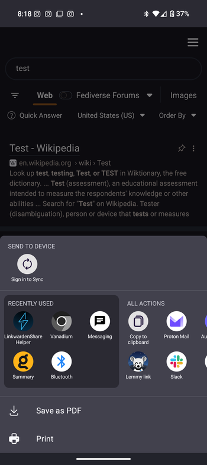

# Linkwarden Share Helper

A simple Android app that allows you to share links directly to your Linkwarden instance.

## Disclaimer

This is a barebones app created by someone who is not an Android developer. It provides basic functionality with minimal error handling and UI polish. Use at your own risk. While it does implement secure storage of credentials, there may be bugs or security issues I'm not aware of.

This app is not officially associated with Linkwarden and is provided as-is without any guarantees.

## Features

- Share links from any app to Linkwarden
- Securely store server details and API token using encryption
- Add tags to shared links
- Assign links to specific collections
- OLED black theme
- Minimal interface

## Setup

1. Install the app (see Installation section below)
2. Open the app and enter your Linkwarden server details:
   - Server URL (e.g., `https://linkwarden.example.com`)
   - API Token (from your Linkwarden settings)
   - Default tags (comma-separated)
   - Default collection ID (optional)
3. Click "Save Settings"

## Usage

1. In any app, find a link you want to save
2. Share the link
3. Select "Linkwarden Share Helper" from the share menu
4. The link will be saved to your Linkwarden instance with the specified tags and collection

## Security

- API token is stored using Android's EncryptedSharedPreferences
- Uses AES256 encryption for stored credentials
- No data is sent to any third parties

## Installation

You can install the app in one of two ways:

1. Download the latest APK from the [Releases](https://github.com/mdecourcy/LinkwardenShareHelper/releases) page
2. Build from source (see Building section below)

The app is automatically built and released using GitHub Actions whenever a new commit is pushed to the master branch.

## Building

1. Clone the repository
2. Open in Android Studio
3. Build using Gradle

## Development

This project uses GitHub Actions for continuous integration and deployment. The workflow is defined in `.github/workflows/build.yml`.

### Branch Structure
- `master`: Stable production code
- `dev`: Main development branch
- `feat/*`: Feature branches
- `hotfix/*`: Hotfix branches

### Workflow
1. Development is done on feature branches (`feat/*`) or hotfix branches (`hotfix/*`)
2. Pull requests are created to merge changes into `dev`
3. When ready for release, `dev` is merged into `master`
4. Pushing to `master` triggers a new build and release

### Versioning
The app uses an automated versioning system:
- Master branch: `1.YYYYMM.DDCCCCC`
- Dev branch: `0.YYYYMM.DDCCCCC-dev`
- Other branches: `0.YYYYMM.DDCCCCC-branchname`

Where:
- `YYYY`: Current year
- `MM`: Current month
- `DD`: Current day
- `CCCCC`: Commit count

### Automated Builds
- Every push to `master`, `dev`, `feat/*`, and `hotfix/*` triggers a build
- Debug APKs are generated for all builds
- GitHub Releases are created only for pushes to `master`

## Contributing

1. Fork the repository
2. Create your feature branch (`git checkout -b feat/amazing-feature`)
3. Commit your changes (`git commit -m 'feat: Add some amazing feature'`)
4. Push to the branch (`git push origin feat/amazing-feature`)
5. Open a Pull Request against the `dev` branch

## Screenshots

  
   

## Acknowledgments

- [Linkwarden](https://github.com/linkwarden/linkwarden) for the amazing bookmark manager
